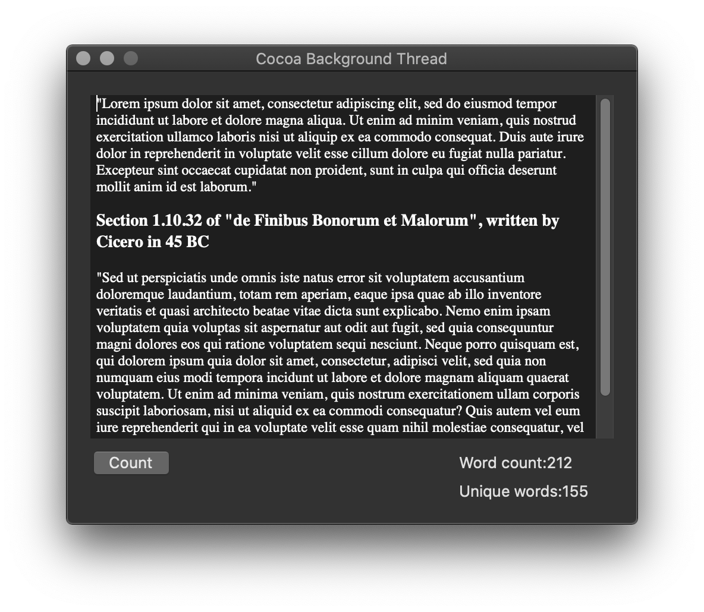

# Cocoa Background Thread

This repository contains implementation of background thread using Grand Central Dispatch (GCD).

[Cocoa macOS Examples](https://github.com/NikolaGrujic91/Cocoa-macOS-Examples)

